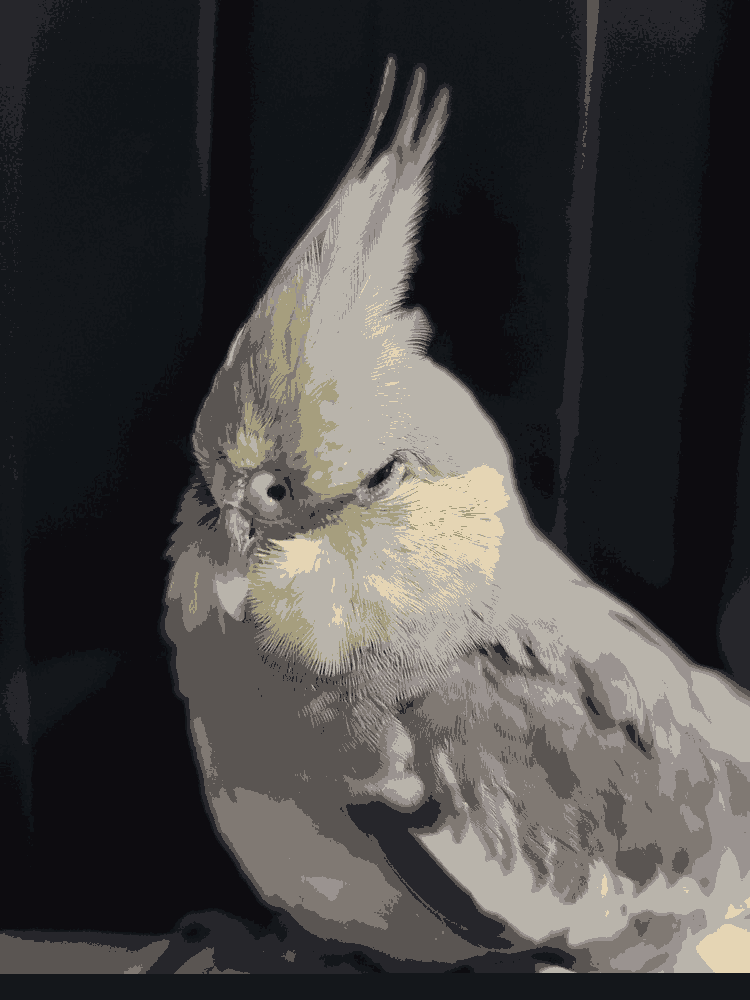

# K-means-image-compressor
This project provides a practical example of an application for [k-means clustering](https://en.wikipedia.org/wiki/K-means_clustering) __outside__ of machine learning.

We use K-means clustering on an image to "compress" it's color space. 
I.e from 256 bits to, say 2-bits. 

# Examples
Original | Using 2 clusters | Using 10 clusters 
------------ | --------------------------- |-------------
 |  | 

Original | Using 4 clusters|  Using 8 clusters 
------------ | --------------------------- |-------------
 |  | 

## How to compile
``make`` or ``make kmeansCompressor``

You need to have CUDA installed on your system to compile

## Usage
``./kmeansCompressor <inputFileName> <outputFileName> <Number of Clusters(K)>``

Where ``<Number of Clusters(K)>`` can be thought of as the number of colors in the output image. 
I.e if k=2 then the output image will only contain 2 colors (because we have 2 clusters). 
In other words, we've compressed the color space of the image to just 2 colors.

## Limitations
* Currently the program only works with PNG files.
* If your PNG image is too big (say 4000 x 4000) the program may fail due to lack of memory

## TODO
Add support for other file types & deal with memory allocation for large images.
