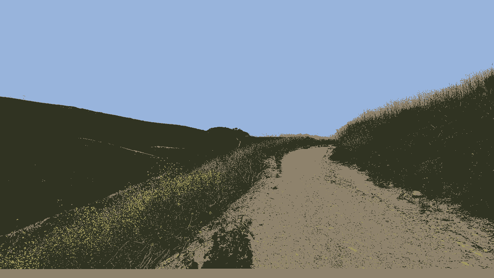

# K-means-image-compressor
This project provides a practical example of an application for [k-means clustering](https://en.wikipedia.org/wiki/K-means_clustering) __outside__ of machine learning.

We use K-means clustering on an image to "compress" it's color palette. 
I.e from 256 colors to, say 2 colors. 

# Examples
Original | Using 2 clusters | Using 10 clusters 
------------ | --------------------------- |-------------
 |  | 

Original | Using 4 clusters|  Using 8 clusters 
------------ | --------------------------- |-------------
 |  | 

## How to compile
Use the makefile:
```
# simplest way to compile, defaults to a release compilation
make
# compile debug build if you're modifying the source and need debug symbols
make debug
# compile release build
make debug
```

You may also be interested in the cuda branch of this project to see how this project is implemented using CUDA

## Usage
``./kmeansCompressor -i <inputFileName> -o <outputFileName> -k <Number of Clusters>``

Example:

``./kmeansCompressor -i input.jpg -o output.png -k 2``

Where ``<Number of Clusters>`` can be thought of as the number of colors in the output image. 
I.e if k=2 then the output image will only contain 2 colors (because we have 2 clusters). 
In other words, we've compressed the color space of the image to just 2 colors.

## Required program arguments
* `-i` Input file name (png or jpg/jpeg image files)
* `-o` Output file name (only png and jpg/jpeg file extensions are supported)
* `-k` Number of clusters/colors/centroids - see description above

## Optional program arguments
* `-x` Enables the use of the CIE 2000 color difference formula instead of the standard Euclidean distance formula
Using the CIE 2000 color difference formula _may_ result in better color quantization, but it is ***noticeably** slower.
Try using this option if you're not satisfy with the results given by the default Euclidean distance formula.

## CIE 2000 color difference vs Euclidean distance formula example:
Both images were processed with k=4 and the same initial centroid values

Original | CIE 2000 | Euclidean distance
------------ | --------------------------- |-------------
 |  | 

## Limitations
* Currently the program only works with PNG files (CUDA VERSION ONLY)
* If your PNG image is too big (say 4000 x 4000) the program may fail due to lack of memory (CUDA VERSION ONLY)
* Only png and jpg/jpeg images are supported
